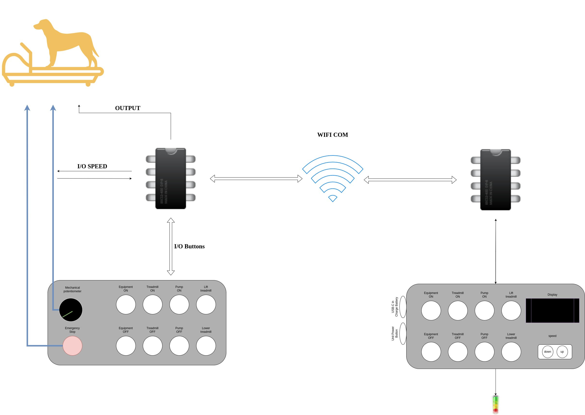

# Treadmill-Remote-Controlling-System
---

  
  
  
  

---
## project goal:

The goal of the project was to build a remote control system for an underwater walker for dogs.

The state of the machine at the beginning of work:
The machine is a machine that is controlled by a controller that activates the motor systems and instruments which receives its commands from a set of buttons sitting on the treadmill itself and connected to it directly used to turn off/on the machine, the water pump, raising the treadmill base up and down, and a potentiometer (responsible for the treadmill's speed).

## System requirements:
1. Creating a remote control system for the treadmill.
2. Option to disconnect our system at any given moment and continue to use the treadmill as it was before the system was installed.

## Project plan:
(See Figure 3)
Remote control - building a remote control using an esp32 microprocessor with a digital display and a set of buttons simulating the set of buttons mounted on the treadmill itself, in addition to a lithium battery connection, a usbc connection to charge the device and a dimmer to control the brightness of the display.

mind on the machine-
(See Figure 4)
Here too we used an esp32 microprocessor. Here we wired all the buttons and modeled the treadmill controller to receive the machine status.

